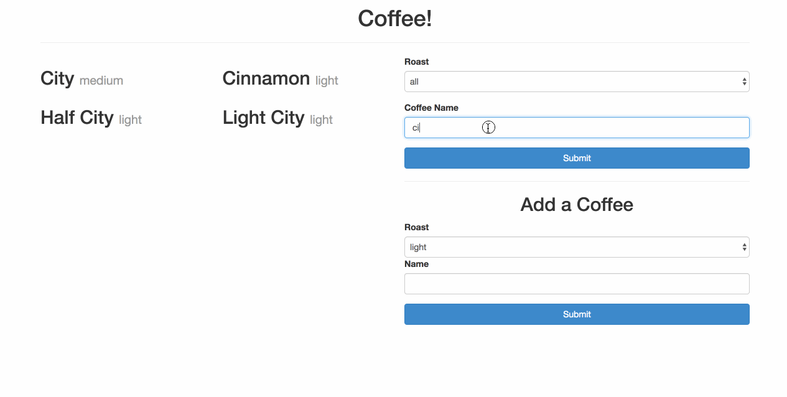

# Coffee Project | Refactored

The primary portion of this project was done as a team.  Deon Rendell, Lorne Cousins, and I completed the initial goals for this project (including the bonus challenges) in less than twenty-four hours.  Afterwards, I decided to both refactor and expand upon our initial work.  As such, I challenge myself with the following goals:
- [X] Ensure Mobile Screen Responsiveness 
- [X] Incorporate application into a simulated company's website 
- [X] Incorporate a warm coffee house style 
- [X] Refactor HTML, CSS, and JS 

## Ideas for Refactor:
- [X] Create persistent data (Browser Cache)
- [ ] Animations 
- [ ] Functional contact form

---

## Current Outcome:
Here are a couple of GIFs that show how the project turned out so far...
#### Coffee App Roast Library Management 

#### Coffee Life Co. Website

---

## Initial Instructions for the Project
### Intro:
> "Congratulations! You have landed your first development job! You have inherited a project from Fancy Coffee Life Co.  &copy;, and they want you to make improvements to it."

### Pre-Instructions:
1. Create a GitHub organization and add your teammate
2. Fork this repository and select the new organization as a destination
3. Clone the forked repository from your organization
4. Open up the HTML file and check out the existing application
5. Read through the code and understand the existing code structure before you start to build the features

### Instructions:
- [X] Update the HTML

    > Tables are a little old school, you need to refactor the code so that each coffee is displayed in a `div` that contains a heading displaying the coffee name, and the type of roast in a paragraph. Don't display the ids, these are only for our application's internal use

- [X] When the page loads, the coffees should be sorted by their Ids in ascending order

- [X] Add functionality to search through the coffees by name, and display only the coffees that match the provided search term (You will need to add an input field to the existing form for this)

- [X] Add functionality to update the displayed coffee as the user types into the search box, or as soon as they select an option from the select.

#### Bonus:

- [X] Add an option to select all roasts for roast type
- [X] Make your name search case-sensitive
- [X] Allow the user to add new coffees to the page
- [X] Create another form on the page that has an input for the coffee name, and a select to choose the coffee roast. When the form is submitted, the new coffee should appear on the page. (*Note that any new coffees you add will be lost when you refresh the page, for an extra challenge, research how `localStorage` works and see if you can find a way to persist the data*)
- [X] Style it!

    The page looks pretty plain as it is, and the refactoring we did above to use `div`s for coffees should give us more flexibility in styling. (*Hint: the styling shown in the example below can be achieved purely with bootstrap classes, that is, without custom CSS*)

### Assignment's Example

Here is an example demonstrating the above functionality. Your application might
look different, but should have the same features.

